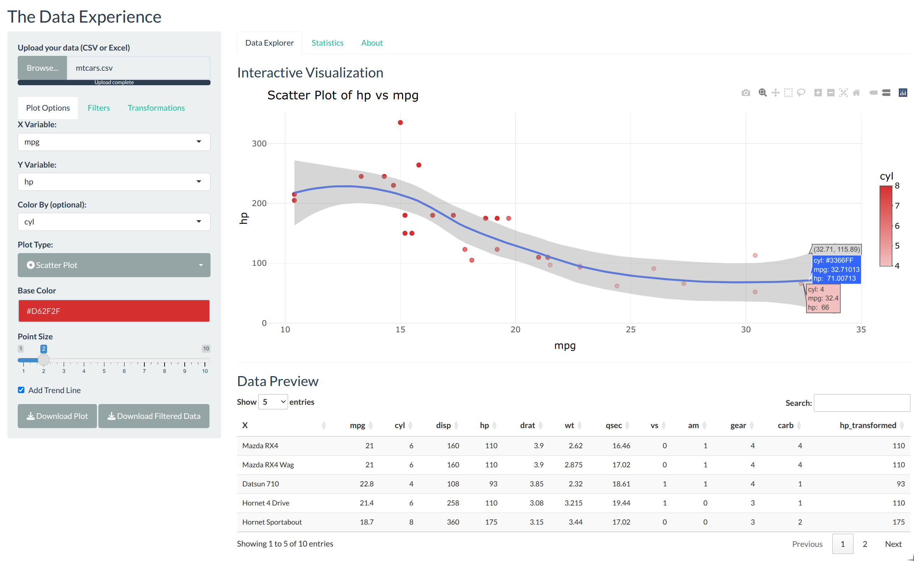

# The Data Experience

The Data Experience is an interactive Shiny application that allows users to add their own datasets (in CSV or Excel format), explore data visually, and perform basic data analysis. It integrates several R packages to offer dynamic filtering, a variety of plotting options, and interactive statistical analysis.



## Features

- Load your own datasets in CSV or Excel format.
- Interactive visualizations:
  - Choose from scatter plot, box plot, histogram, bar chart, line chart, and density plot.
  - Customizable plot options such as color selection, point size, and trend lines.
  - Interactive plots built with Plotly for zooming, panning, and hovering.
- Automatically generated filters based on the data types (numeric or categorical) to refine the dataset view.
- Options to transform the Y variable using transformations like Log, Square Root, Z-Score, and Min-Max Scaling.
- Summary statistics for selected variables.
- Correlation analysis with an interactive heatmap for numeric variables.
- Ability to download the current plot as a PNG and the filtered dataset as a CSV file.

## Installation

1. Prerequisites:
   Ensure you have R installed on your system. You will also need the following R packages:

   - `shiny`
   - `dplyr`
   - `ggplot2`
   - `DT`
   - `plotly`
   - `readxl`
   - `shinythemes`
   - `colourpicker`
   - `shinyWidgets`

2. Install Required Packages:
   You can install the required packages using the following commands in R:

```r
install.packages(c("shiny", "dplyr", "ggplot2", "DT", "plotly", "readxl", "shinythemes", "colourpicker", "shinyWidgets"))
```

3. Run the App:
   Save the app.R file in your working directory and run the app in your console with the following command:

```r
shiny::runApp("app.R")
```

## Usage

1. Load Your Data:
   Use the file input to upload your CSV or Excel file. Once uploaded, the app will automatically read your dataset and populate variable selection options.

2. Select Variables and Options:

   - Choose the variables for the X and Y axes.
   - Optionally select a variable for color grouping.
   - Pick the desired plot type and customize the appearance using the provided options.
   - Use dynamic filters to narrow down the dataset view based on variable values.
   - Apply data transformations on the Y variable if needed.

3. View and Analyze:

   - The Data Explorer tab provides an interactive plot and a data preview table.
   - The Statistics tab displays summary statistics and, if applicable, a correlation analysis heatmap.

4. Download Options:

   - Download the current plot as a PNG file.
   - Download the filtered dataset as a CSV file.

## Code Overview

The application is structured as a typical Shiny app with a `ui` component defining the layout and an accompanying `server` function handling data processing and interactive rendering. Key components include:

- **Dynamic UI Generation**: Automatically creates filter options based on the uploaded dataset.
- **Reactive Data Processing**: Uses reactive expressions to update plots and data views as users change inputs.
- **Integration with Plotly**: Converts ggplot2 charts into interactive Plotly plots for enhanced user experience.

For full details of the app code, please refer to the app.R file.
